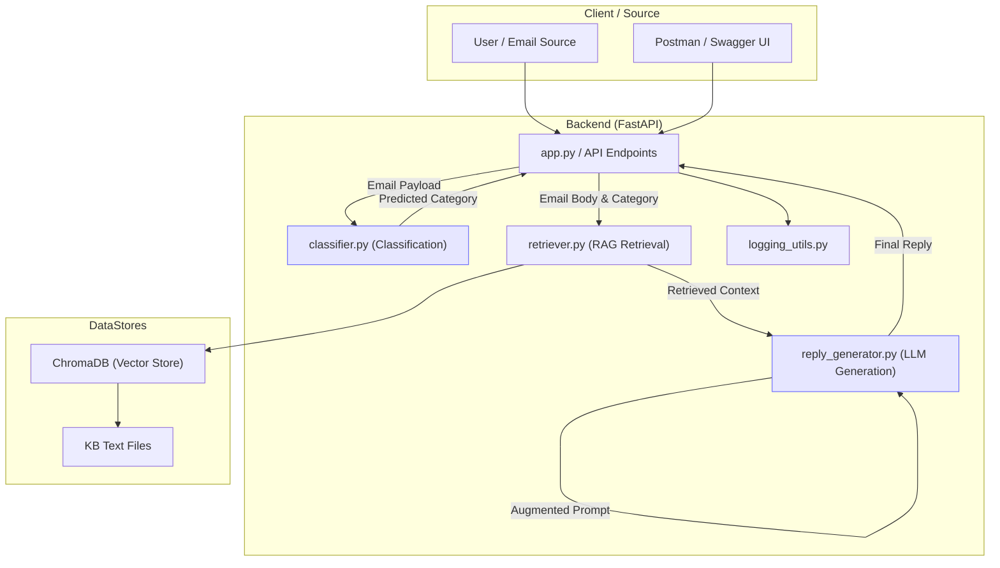
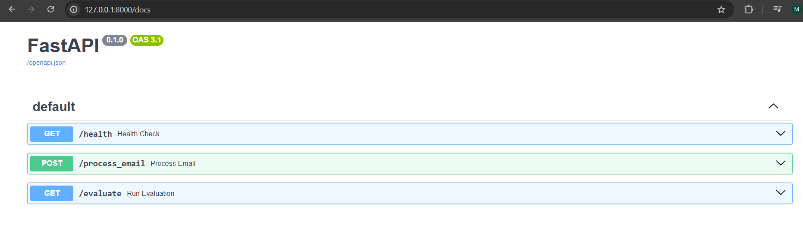
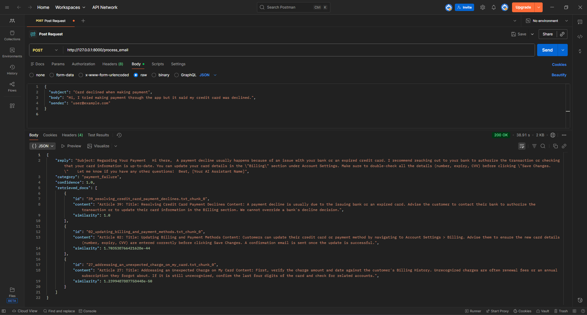
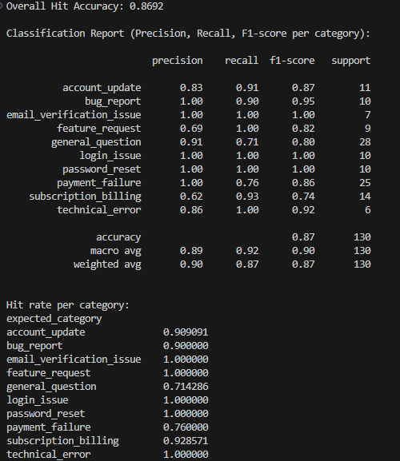
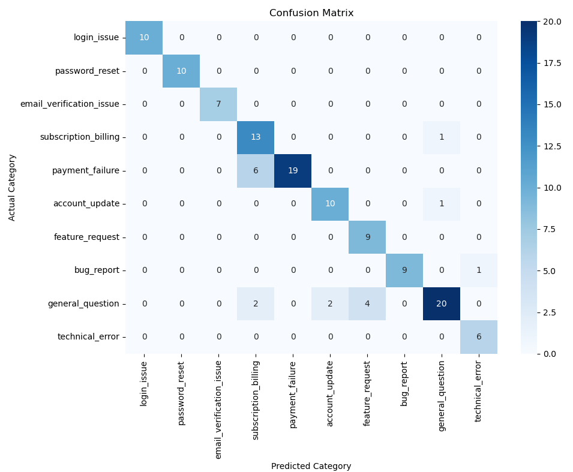
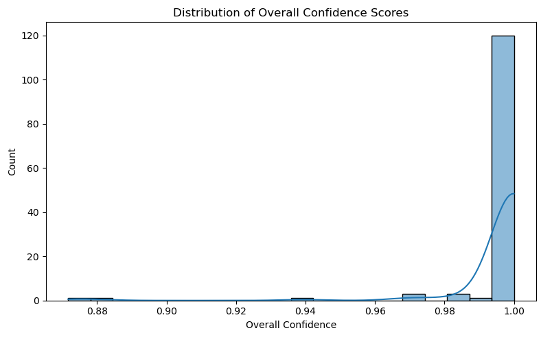

# Classification Enhanced AI Customer Support Ticket Responder

**Project Overview:**  

This project implements a **Classification Enhanced Retrieval Augmented Generation (RAG)** system for automating customer support ticket classification and reply generation. It combines local LLMs **(Gemma 2:9b via Ollama)** with **ChromaDB** vector storage for Knowledge Base (KB) retrieval. Tickets are first classified into predefined categories, relevant KB articles are retrieved, and professional, context aware responses are then generated, all running **offline and privacy preserving**.

---

## Features

- **Classification Enhanced RAG:** The classification step acts as a router to improve retrieval precision and ensure highly context aware replies.
- **Local LLMs:** Utilizes Gemma 2:9b and mxbai-embed-large via Ollama for entirely offline inference.
- **Knowledge Base Retrieval:** Semantic search over KB articles stored in ChromaDB.
- **Reply Generation:** Generates professional responses strictly based on retrieved KB content.
- **Evaluation & Metrics:** Calculates hit rate, precision, recall, F1 score per category, and visualizes results with confusion matrices, bar plots, and confidence distributions.
- **Privacy Focused & Offline:** No external API calls for sensitive data; LLM runs locally.
- **Logging:** Structured JSON logs for all processed tickets.

## Tech Stack

- **Programming Language:** Python 3.10+  
- **API Framework:** FastAPI  
- **Local LLMs:** Gemma2:9b via Ollama  
- **Vector DB:** ChromaDB  
- **Data Processing:** NumPy, Pandas  
- **Machine Learning Metrics:** scikit-learn  
- **Visualization:** Matplotlib, Seaborn  
- **Utilities:** tqdm, Python logging  

---

## Project Structure

```
Company_Ticket_Auto_Responder_RAG/
│
├─ backend/
│ ├─ __init__.py
│ ├─ app.py 
│ ├─ classifier.py          # LLM based ticket classification
│ ├─ retriever.py           # KB document retrieval (embedding + query)
│ ├─ reply_generator.py     # Generates replies based on KB content
│ ├─ evaluate.py            # Generates evaluation_results.csv
│ ├─ Eval.py                # Metrics & visualization
│ ├─ logging_utils.py       # Ticket logging
│ ├─ logging_config.py      # App logging
│ ├─ ollama_client.py       # Local Ollama client wrapper
│ └─ test_dataset.json      # Sample dataset for evaluation
│
├─ kb/                      # Knowledge Base articles (Text files)
│
├─ requirements.txt         # Python dependencies
└─ README.md
├─ assets/


```

## Architecture Diagram

This diagram illustrates the separation of concerns: the Classification step runs first to triage the ticket, which then informs the subsequent Retrieval Augmentation and Generation steps.


**The classifier reduces retrieval noise by routing the ticket to its correct category before vector search.**

## Demo

Below are the key screenshots demonstrating how the system works end-to-end.

### 1. FastAPI Swagger UI
Shows the available endpoints (`/health`, `/process_email`) and how the API is exposed for manual testing.



### 2. Successful Email Processing via Postman
Example of sending a JSON email payload and receiving:
- predicted category  
- classifier confidence  
- retrieved KB documents  
- generated email reply 



## Evaluation Section (Confusion Matrix & Metrics)
The system was evaluated on a labeled dataset of 130 customer support emails covering all 10 categories. The project underwent an iterative refinement process (Prompt Engineering) to resolve semantic ambiguity, achieving the following results:

### Final Classification Report
The model achieved an **Overall Hit Accuracy of 86.92%** and a **Weighted F1 score of 0.87**. This report demonstrates strong Precision and Recall for critical, high volume issues like 'login_issue' and 'password_reset'.



### Final Confusion Matrix
The final Confusion Matrix visually confirms the success of the optimization. We reduced the off diagonal errors, demonstrating that the model successfully learned the **semantic difference** between similar sounding categories, a key engineering challenge.



### Model Stability (Confidence Scores)
The distribution of confidence scores shows that when the model makes a prediction, it is highly certain, with the vast majority of scores clustered near 1.00. This indicates a robust and reliable system for production deployment.



Results Summary:
- Overall Hit Accuracy: 86.9%
- Best performing categories: email_verification_issue, login_issue, password_reset (100% hit rate)
- Lower performing categories: subscription_billing (93% Recall), payment_failure (76% Recall)

## Installation & Setup

Prerequisites

- Python 3.10+

- Ollama installed

- 8GB+ RAM recommended & Dedicated GPU

1. Clone the repository

```bash

git clone https://github.com/lutfihadiCEX/Company_Ticket_Auto_Responder_RAG.git

cd Company_Ticket_Auto_Responder_RAG

```
2. Install dependencies

```bash

pip install -r requirements.txt

```
3. Ollama setup

```bash

ollama pull gemma2:9b           # Classification and Generation Model
ollama pull mxbai-embed-large   # Embedding Model for RAG Retrieval

# Start the Ollama background service in a separate terminal or process:
ollama serve

```

4. Initialize the Knowledge Base (KB)

The system must embed your KB articles and store them in ChromaDB before the RAG pipeline can function.

Ensure all your .txt or relevant KB files are located in the kb/ folder.

Run the following script to process the documents and build the vector store:

```bash

python backend/retriever.py 

```

Note: This step only needs to be performed once, or whenever you add new articles to the kb/ folder.

5. Run the API Service

Start the FastAPI application. This launches the server that handles the classification and response generation pipeline.

```bash

uvicorn backend.app:app --reload

```

The service will be live at http://localhost:8000. You can access the interactive Swagger UI documentation at http://localhost:8000/docs to test the /process_email endpoint immediately. You can also test the API through Postman to send email requests

**Example Request Body**

Use this sample request body in Swagger UI or Postman (Body -> raw) section to test the /process_email endpoint.

```json

{
  "subject": "Problem in checkout. Page says 'Unauthorized Transaction'",
  "body": "I am trying to purchase the available plan through the app, but the payment gateway returns an 'Unauthorized Transaction' error message. I've used this card elsewhere today without having any problems.",
  "sender": "JohnDoe@maistri.com"
}

```

6. Evaluation

```bash

python backend/evaluate.py
python backend/Eval.py      # Reads CSV generated by evaluate.py

```


## Highlights

- Privacy focused: Fully offline local LLM (Gemma2:9B) inference.

- Cost efficient: No paid cloud LLM API calls required.

- Classification Enhanced RAG: Advanced architecture combining routing with grounding

- Validation: Quantitatively optimized process (87% F1 score).

## Author

Lutfihadi

## Disclaimer

This is a research project exploring how LLMs can automate internal customer support tools and workflows. It is not intended for production use without additional security validation and MLOps hardening.